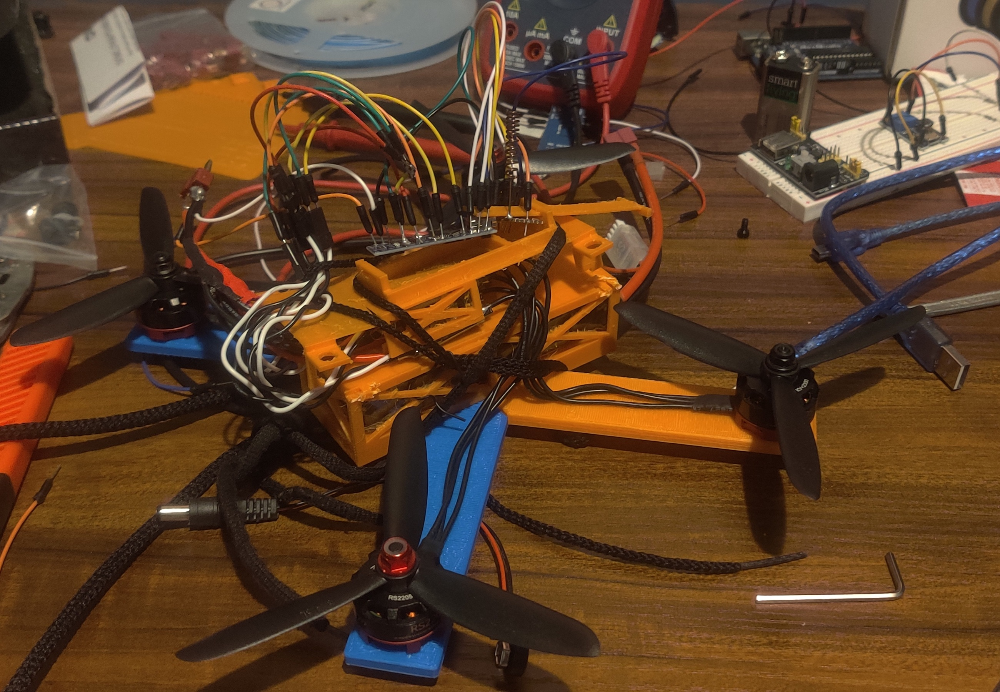
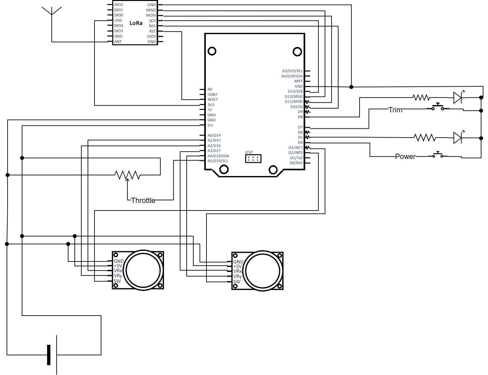

# BasicDrone Project

This is a custom-designed Arduino-based drone and controller system that uses a LoRa transceiver for reliable communication. The project includes 3D printed components modeled in Blender and a custom software sketches.

## 🚀 **Project Overview**

This project aims to create an affordable, modular, and easy-to-build drone system. The drone is powered by an Arduino Nano, while the controller uses an Arduino Uno for flight control. Communication between the drone and the controller is handled by a robust LoRa transceiver.

### **Features**
- Arduino Nano-based drone with custom code for optimal motor control and sensor integration.
- Arduino Uno-based controller for user-friendly flight controls.
- LoRa transceiver for long-range wireless communication.
- Blender-designed 3D printed parts for lightweight and customizable drone assembly.

## 🛠️ **Parts List**

### **Drone:**
- Arduino Nano
- LoRa SX1276 transceiver module
- EMAX RS2205 2300kv brushless motor (x4)
- BLHeli LittleBee Electronic Speed Controllers (ESCs) (x4)
- 5' Propellers (x4)
- 3D printed frame components
- Ovonic 3S 50C 2200mAh 11.1V LiPo Battery 
- GY-521 MPU-6050 Gyroscope & Accelerometer
- ArduCAM-2MP-Plus B0067
- Misc: wires, heat shrink tubing

### **Controller:**
- Arduino Uno
- LoRa SX1276 transceiver module 
- Joystick modules (x2)
- Misc: push buttons, resistors, LEDs, wires

## 🧩 **CAD Design & Prototyping**

All 3D models for this project were designed in **Blender**, with an emphasis on simplicity and structural integrity. The designs are optimized for 3D printing using widely accessible filament-based printers. 

### **Prototype Images:**
**

## ✍️ **Schematics**

The schematics for the drone and the controller detail the electrical connections, ensuring you can replicate the design accurately. 

### Drone
**

### Controller
**

## 🎯 **Getting Started**

1. Install the Arduino IDE for uploading the custom code to the boards.
2. Have Blender or another CAD software installed if you wish to modify or customize the 3D models.
3. Ensure access to a 3D printer for building the mechanical components.
4. Total printed items includes:
    - Drone top & bottom
    - 4x pins
    - 2x each of Left/Right Wings (for front and back)
    - Securing bar for Ardunio Nano
5. Flash Arduino Uno with the `drone_transmitter_post` sketch and Arduino Nano with the `drone_receiver_post` sketch.

## 📜 **License**
This project is licensed under the MIT License - see the [LICENSE](LICENSE) file for details.
